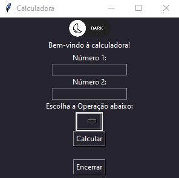
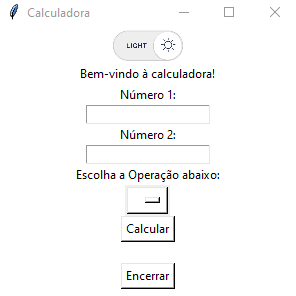

# Python Calculator

Application made in Python with Tkinter with switch theme mode.

## Rubric 

Calculator with addition subtraction multiplication division exponentiation root functions.

Dark Mode Preview

Light Mode Preview
